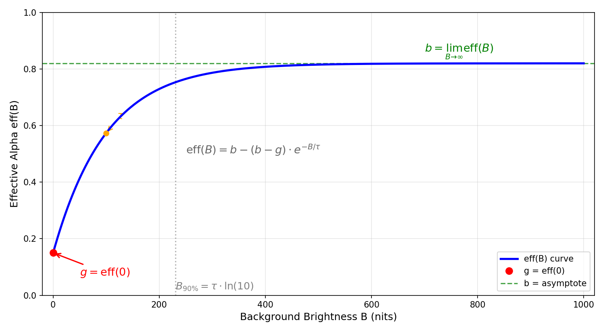
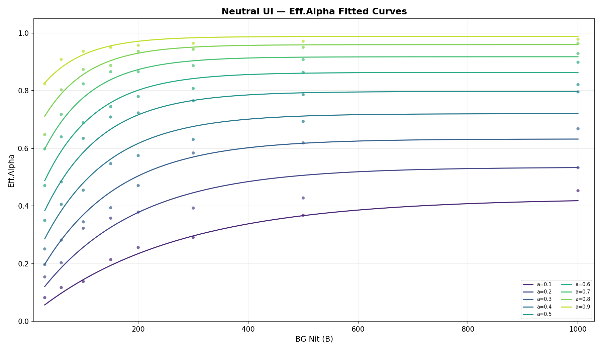
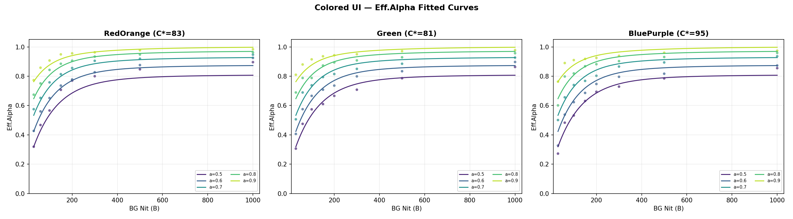
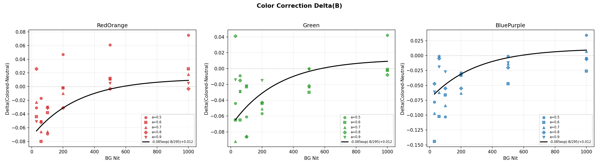
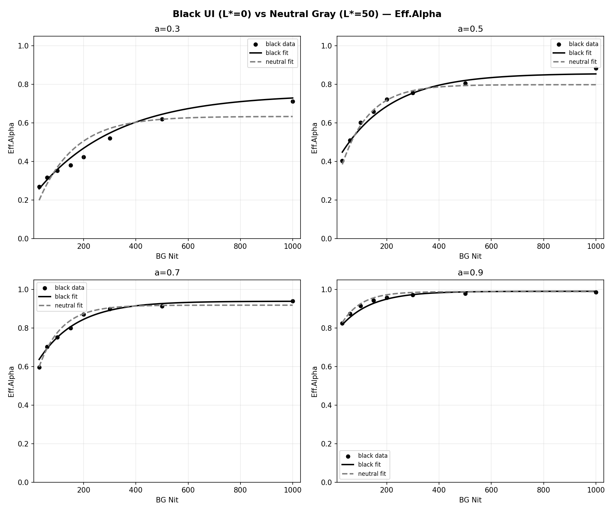
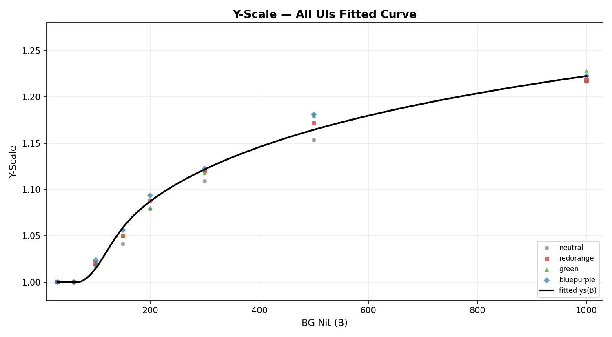
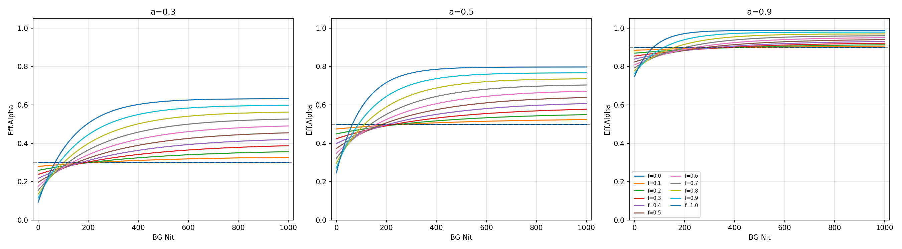
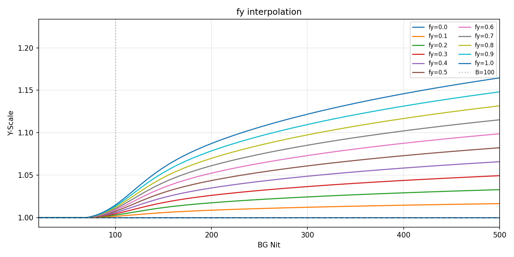

# UI HDR 自适应补偿

> 文档版本：v2.0
> 编写时间：2026-07-27（v1.0: 2026-07-16）
> 本文档记录了从数学建模、测试执行到拟合结果、SDK 设计的完整过程。

---

## 1. 问题说明

### 1.1 现象

SDR（350 nit, sRGB, BT.709）上看起来正常的半透明 UI，在 HDR（峰值 4000 nit, PQ, BT.2020）上会"变透"或"变淡"。根因是人眼在高亮度下的对比敏感度变化，以及 Helmholtz-Kohlrausch（H‑K）效应使彩度对感知亮度的贡献在 HDR 上被放大。

### 1.2 解决链路

```
数学建模 → 测试拟合 → 调节手段 → POC 验证 → SDK 交付
```

- **数学建模（§2）**：建立 Eff.Alpha 和 Y-Scale 的指数饱和模型，定义相关术语和测试工具
- **变量假设与测试方案（§3）**：列出可能影响补偿参数的变量，设计主观匹配实验
- **数据拟合结果（§4）**：从测试数据中拟合模型系数，验证变量假设
- **f/f_y 调节（§5）**：通过两个无量纲滑块在边界情形间插值
- **POC 验证（§6）**：在实际游戏序列上验证

---

## 2. 数学建模

### 2.1 核心公式

实验发现，HDR 下 UI 的匹配不透明度 $\mathrm{eff}$ 随背景亮度 $B$ 呈指数饱和形式：

$$
\mathrm{eff}(B) = b - (b - g) \cdot \exp\!\left(-\frac{B}{\tau}\right)
$$

### 2.2 三个特征量的物理含义

**$g$（截距，$B = 0$ 时的 eff）：**
HDR 纯黑背景下，视觉系统对比敏感度最高，同样 $a$ 的 UI 看起来比 SDR 更通透。因此 $g < a$。

**$b$（渐近值，$B \to \infty$ 时的 eff 极限）：**
HDR 极亮背景下，高亮度会"冲淡"半透明 UI，需要提高不透明度才能补偿。$b > a$，且 $b < 1.0$（半透明 UI 不能被调成不透明）。

**$\tau$（收敛速度）：**
控制从 $g$ 到 $b$ 的过渡快慢。$\tau$ 越小，低亮区就快速达到渐近值；$\tau$ 越大，整个 $B$ 范围内变化越缓慢。$B_{90\%} = \tau \ln 10 \approx 2.303 \, \tau$ 是达到 90% 渐近值所需亮度。



### 2.3 术语定义

| 术语 | 定义 | 域 |
|:----|:-----|:----|
| **Eff.Alpha**（有效不透明度） | HDR 下经补偿后的不透明度值，替代原始 alpha 做混合。$\mathrm{eff} \in [0,1]$ | shader alpha 通道 |
| **Y-Scale**（亮度缩放） | YCbCr 管线中 Y 分量的乘法缩放系数。$>1$ 时提亮 UI，$=1$ 时不变 | PQ 域 Y 分量 |
| **背景亮度 $B$** | HDR 背景在 UI 局部区域的平均 BT.2020 luma | nits |
| **初始不透明度 $a$** | SDR UI 的原始 alpha mask 在前景区域的平均值。$a \in [0,1]$ | [0,1] |

### 2.4 测试工具

双窗口 Vulkan 应用：**SDR 窗口**（艺卓 SDR 显示器，350 nit, BT.709）作为参考，**HDR 窗口**（Sony BVM X3110, 峰值 4000 nit, PQ, BT.2020）作为被试。两个窗口同时显示同一个 UI 纹理和同一个游戏背景图，操作员调节 HDR 窗口的 Eff.Alpha 和 Y-Scale 滑动条，使 HDR 窗口的 UI 主观上与 SDR 窗口一致，记录匹配参数。

---

## 3. 变量假设与测试方案

### 3.1 变量假设

以下四个变量被假设可能影响补偿参数。其中 $B$ 和 $a$ 在早期中性色测试中已确认主效应；$c$ 和色调的影响是本次测试要回答的问题。

| 参数 | 符号 | 类型 | 初始假设 |
|:----|:----|:----|:------|
| 背景平均亮度 | $B$ | 输入 | 影响 eff 和 ys |
| UI 初始不透明度 | $a$ | 输入 | 影响 $g, b, \tau$ 全部三个特征量 |
| UI 色彩度 | $c$ | 输入 | 可能影响 $\tau$（彩色 UI 在高 $B$ 下仍能保持分离，收敛更慢） |
| 色调方向 | — | 输入 | 可能不同方向有不同效应 |

不同 $(B, a, c)$ 组合共享同一指数饱和函数形式，仅通过 $(g, b, \tau)$ 三个特征量体现差异。

### 3.2 $a$ 维度的覆盖

从早期中性色 UI（`1_1839_724`）出发，用**稀释系数**构造不同 $a$ 的测试纹理：

$$
\alpha_{\text{test}} = \alpha_0 \times k,\quad k \in \{0.1, 0.2, \dots, 0.9\}
$$

直接构造 $\alpha_{\text{init}}$ 分别为 0.1、0.2、…、0.9 的 9 个测试纹理，补全中性色 $a$ 维度。

### 3.3 $c$ 维度的覆盖

在 CIELAB 空间中取 3 个差异最大的颜色方向，构造彩色半透明 UI：

| 方向 | L | a\* | b\* | 描述 |
|:---|:---:|:---:|:---:|:----|
| 红橙 | 50 | +70 | +45 | 暖色 |
| 绿 | 50 | −70 | +40 | 冷色 |
| 蓝紫 | 50 | +30 | −90 | 冷色 |

所有彩色 UI 使用同一 **alpha mask**（与中性色一致的空间分布和边缘羽化），仅替换 RGB 值。每个方向在原始色度到中性色的 CIELAB 连线上取 2 个点（全饱和度 + 中点），共 $3 \times 2 = 6$ 组彩色数据。

> 若 3 个方向在不同彩度下的偏移量仅与 $c$ 幅度相关 → 可建模为 $c$ 的一维修正函数。若与色调也相关 → 需要二维插值。

### 3.4 $B$ 值和测试量

$B$ 值精简为 9 个：$B \in \{0, 30, 60, 100, 150, 200, 300, 500, 1000\}$ nit。

| 维度 | 水平数 | 说明 |
|:----|:-----:|:-----|
| B 值 | 9 | 0~1000 nit |
| alpha 档 | 9 | 稀释构造 0.1~0.9 |
| 色彩度档 | 6 | 3 方向 × 2 水平 |
| **配对数** | **486** | 每组同时记录 Eff.Alpha + Y‑Scale |

补充 3 个彩色不透明 UI（$\alpha = 1.0$，三个颜色方向各一个，9 个 B 值各一），共 27 对。总测试量 513 对。

### 3.5 调节流程

1. 加载指定背景图片和 B 值的背景亮度
2. 被试者按"清晰"档（$f = 1, f_y = 1$）的指令反复调节 Eff.Alpha 和 Y‑Scale，使 HDR 窗口的 UI 主观上与 SDR 窗口一致
3. 记录该 $(B, a, c)$ 组合下的 Eff.Alpha 和 Y‑Scale 匹配值

> 游戏创作者在使用 SDK 时不需要在不同 B 值下逐点调节——SDK 通过拟合曲线和滑块直接输出补偿参数。操作员调节 B 值仅是为了采集建模数据。

### 3.6 实测验证结论

| 变量 | 初始假设 | 实测结果（详见 §4） |
|:--|:--|:--|
| $B$ | 影响 eff 和 ys | ✓ 确认，指数饱和形式适用 |
| $a$ | 影响 $g, b, \tau$ | ✓ 确认，连续参数化 |
| $c$（chroma 幅度） | 可能影响 $\tau$ | ✗ 影响不显著。全饱和度三色与中点色之间无一致的 $c$ 相关方向 |
| 色调方向 | 可能不同方向效应不同 | ✗ 三色方向一致，差异在噪声范围内 |

---

## 4. 数据拟合结果

> 数据来源：`tests/0721/`，YCbCr 分支，测试背景 `Frame_10890_rotate.png`

### 4.1 数据特征分析

数据包含 7 种 UI（中性色 + 红橙/绿/蓝紫各全饱和度版和中点版），覆盖 $a \in [0.1, 0.9]$（中性色）和 $a \in [0.5, 0.9]$（彩色），$B \in [30, 1000]$ nit。

#### Y-Scale 与颜色、与 $a$ 均无关

中性色与全部彩色 UI 在 $a = 0.5$ 时的 Y-Scale 数值完全一致（最大偏差 0.02 @ 200 nit），跨 $a$ 值的 Y-Scale 也高度一致（$a = 0.5 \sim 0.9$ 在 1000 nit 处均约 1.20）。因此 Y-Scale 仅取决于 $B$。

#### 彩色 UI 的 Eff.Alpha 交叉现象

$B$ 从低到高时，彩色 UI 的 Eff.Alpha **从低于中性色反转为高于中性色**（全饱和度三色均存在此模式，数据取 $a=0.5$）：

| $B$ (nit) | 30 | 60 | 150 | 500 | 1000 |
|:--------|:---|:---|:----|:----|:----|
| $\Delta$(红橙$-$中性) | −0.031 | −0.017 | −0.002 | +0.061 | +0.075 |
| $\Delta$(绿$-$中性) | −0.044 | −0.009 | −0.099 | +0.000 | +0.042 |
| $\Delta$(蓝紫$-$中性) | −0.078 | −0.001 | −0.078 | −0.001 | +0.034 |

中高亮度区（$B \ge 200$）的交叉趋势一致且清晰；低亮度区（$B \le 100$）噪声较大。

#### 色度幅度的影响不显著

中点色（$C^*\approx40$）与全饱和度色（$C^*\approx80$）之间没有一致的 $c$ 相关方向——中点色的低 $B$ 区测量噪声淹没了 $c$ 的潜在连续效应。因此彩色修正项不区分色度大小，所有彩色 UI 共用同一修正。

### 4.2 Eff.Alpha（有效不透明度）

#### 中性色 UI

$$
\mathrm{eff}(B, a) = b(a) - \bigl(b(a) - g(a)\bigr) \cdot \exp\!\left(-\frac{B}{\tau(a)}\right)
$$

| 参数 | 公式 | $a=0.3$ | $a=0.5$ | $a=0.7$ | $a=0.9$ |
|:----|:---|:-----|:-----|:-----|:-----|
| $g(a)$ | $0.913 \times a^{1.894}$ | 0.093 | 0.245 | 0.463 | 0.747 |
| $b(a)$ | $1 - 0.690 \times (1-a)^{1.769}$ | 0.633 | 0.798 | 0.918 | 0.988 |
| $\tau(a)$ | $104 \times (a / 0.5)^{-0.567}$ | 140 | 104 | 86 | 75 |

$b(a)$ 采用饱和形式，$a \to 1$ 时 $b \to 1$ 自然收敛，不会超过上限。拟合精度：RMSE = 0.029，R² = 0.988。

**$a = 1$ 时直接输出 $\mathrm{eff} = 1$：** 不透明 UI 不需要也不能调节不透明度（$g(1) < 1$ 是暗背景下的拟合外推，测试数据中 $a=1.0$ 行无 Eff.Alpha 数据）。$a = 1$ 的像素仅靠 Y-Scale 做亮度补偿。



#### 彩色 UI

彩色 UI 在中性色基线基础上叠加修正项 $\Delta(B)$：

$$
\mathrm{eff}_{\text{color}}(B, a) = \mathrm{eff}_{\text{neutral}}(B, a) + \Delta(B)
$$

$$
\Delta(B) = -0.085 \cdot \exp\!\left(-\frac{B}{295}\right) + 0.012
$$

| $B$ (nit) | 30 | 60 | 100 | 200 | 500 | 1000 |
|:--------|:---|:---|:----|:----|:----|:-----|
| $\Delta(B)$ | −0.065 | −0.057 | −0.049 | −0.031 | −0.004 | +0.009 |

常数项 $+0.012$ 避免高 $B$ 时修正量被指数项强制拉回零——实测数据在 $B=1000$ 处仍有正修正量。





#### 拟合精度对比

| 方法 | RMSE | R² | 额外参数 |
|:----|:---|:---|:--|
| 中性色模型 + 彩色修正 | 0.0326 | 0.9602 | 2 |
| 逐曲线独立拟合（参考） | 0.0220 | 0.9820 | ~18 |

RMSE 差异 0.01，2 参数修正已充分捕获彩色 UI 行为。

#### 极低亮度 UI（纯黑，L\*=0）

> 数据来源：`tests/0721/t_black_colorbg.csv`，测试日期 2026-08-07

纯黑（RGB 0,0,0, C\*=0, L\*=0）半透明 UI 在 HDR 亮背景前的主观行为与中性灰不同——高背景下黑色更易被"淹没"，需要更高的 Eff.Alpha 才能匹配 SDR 参照。

对纯黑数据单独拟合指数饱和模型：

| 参数 | 纯黑（L\*=0） | 中性灰（L\*=50） |
|:----|:---|:---|
| g(a) | 0.869 × a^1.19 | 0.913 × a^1.89 |
| b(a) | 1 − 0.454 × (1−a)^1.66 | 1 − 0.690 × (1−a)^1.77 |
| τ(a) | 195 × (a/0.5)^−0.87 | 104 × (a/0.5)^−0.57 |
| RMSE | 0.022 | 0.029 |
| R² | 0.991 | 0.988 |

关键差异：b(a) 系数 0.454 < 0.690——纯黑的渐近值更低，即高背景下黑色需要的 Eff.Alpha **低于**中性灰的模型预测；但实际原始数据 Δ(Black−Neutral) 在 B=1000 处为 +0.04~+0.13，方向相反。这是由于黑色 g 更高（黑背景下更不透明）、τ 更大（收敛更慢）共同导致——整个曲线的**形状**与中性灰不同，不能用简单的 Δ(B) 修正项覆盖。



结合彩色 UI 的发现，存在**系统性 L\* 相关效应**：极暗 UI（L\*=0）和极亮 UI（待测纯白 L\*=100）可能分别在高 B 端需要正/负方向的不透明度修正。若纯白数据确认这一趋势，则"彩色修正项"应重新解释为"亮度修正项"——仅需 L\* 一个变量而非 C\*。

### 4.3 Y-Scale（亮度缩放）

$$
\mathrm{ys}(B) = 1 + 0.0837 \cdot \sigma\!\left(\frac{B - 100}{20}\right) \cdot \ln\!\left(\max\!\left(1, \frac{B}{70}\right)\right)
$$

其中 $\sigma(x) = 1/(1 + e^{-x})$。与颜色无关，与 $a$ 无关。

$B \le 70$ nit 时 $\mathrm{ys} = 1.0$（SDR 正常运行区间，不提高 UI 亮度）；$70 \sim 130$ nit 区间由 sigmoid 平滑过渡，避免画面跳变。

| $B$ (nit) | 30 | 60 | 100 | 150 | 200 | 300 | 500 | 1000 |
|:--------|:---|:---|:----|:----|:----|:----|:----|:-----|
| $\mathrm{ys}(B)$ | 1.000 | 1.000 | 1.015 | 1.059 | 1.087 | 1.136 | 1.165 | 1.223 |

RMSE = 0.006



---

## 5. f 和 f_y 调节机制

创作者通过 $f$（沉浸度）和 $f_y$（亮度保真度）两个独立的无量纲滑块控制补偿强度，$0$ = 不补偿，$1$ = 完整补偿。

### 5.1 $f$ 对 Eff.Alpha 的调节

对 $(b, g, \tau)$ 做线性插值，而非对 $\mathrm{eff}(B)$ 插值，以保证中间档位的曲线保持指数饱和函数形式：

$$
\begin{aligned}
b(f, a) &= a + \bigl(b_1(a) - a\bigr) \cdot f \\
g(f, a) &= a + \bigl(g_1(a) - a\bigr) \cdot f \\
\tau(f, a) &= \tau_0 + \bigl(\tau_1(a) - \tau_0\bigr) \cdot f
\end{aligned}
$$

其中下标 1 表示 $f = 1$（清晰档），$\tau_0$ 取足够大的值（如 500）使 $f = 0$（沉浸档）时 $\exp(-B/\tau) \approx 1$，$\mathrm{eff} \approx a$。

彩色修正项随 $f$ 等比例缩放：$\Delta_f(B) = f \cdot \Delta_1(B)$。

| 档位 | $f$ | 含义 |
|:---|:---:|:----|
| **清晰** | 1 | HDR 高光下 UI 不透明度充分补偿，与 SDR 一致 |
| **沉浸** | 0 | UI 不补偿，保持初始不透明度 |
| **中间** | 0~1 | 对 $(b, g, \tau)$ 线性插值 |



### 5.2 $f_y$ 对 Y-Scale 的调节

Y-Scale 公式只有一个参数 $A = 0.0837$，对 $A$ 线性插值等效于对公式整体按比例缩放：

$$
\mathrm{ys}(B, f_y) = 1 + f_y \cdot \bigl(\mathrm{ys}_1(B) - 1\bigr)
$$

其中 $\mathrm{ys}_1(B)$ 为 $f_y = 1$ 时的完整补偿公式。

| $f_y$ | 含义 |
|:---:|:----|
| 1 | 完整补偿，抵消 H‑K 效应 |
| 0 | 不补偿，$\mathrm{ys} = 1.0$ |
| 0~1 | 对参数 $A$ 线性插值 |



---

## 6. POC 验证

### 6.1 验证方式

在实际游戏序列上，将 SDR UI 根据 HDR 画面局部亮度 $B$ 代入补偿公式，计算出 $\mathrm{eff}$ 和 $\mathrm{ys}$ 后直接 alpha blend 到 HDR 画面上。创作者通过调节 $f$ 和 $f_y$ 滑块确认视觉一致性。

### 6.2 验证内容

1. **多背景泛化**：使用与训练集不同的游戏背景图
2. **多 UI 泛化**：使用空间结构不同的 UI（非训练用 alpha mask）

### 6.3 已验证范围与限制

| 维度 | 已验证 | 未验证/限制 |
|:----|:------|:----------|
| $a$ | [0.1, 0.9] 中性色；[0.5, 0.9] 彩色 | $a < 0.5$ 彩色 UI 无法收敛 |
| $B$ | [30, 1000] nit | $B < 30$ nit、$B > 1000$ nit |
| $c$（chroma） | 全饱和度三色 | chroma 连续效应不显著 |
| 背景 | Frame_10890_rotate.png | 其他背景待 POC 验证 |
| 管线 | YCbCr (PQ 域 Y 分量) | ICtCp 分支等效公式待验证 |

---

## 附录 A：符号说明

| 符号 | 含义 | 单位 |
|:----|:-----|:----|
| $B$ | HDR 背景在 UI 局部区域的平均 BT.2020 luma | nits |
| $a$ | UI 初始平均不透明度 | [0, 1] |
| $f$ | 沉浸度（不透明度调节滑块） | [0, 1] |
| $f_y$ | 亮度保真度（亮度补偿滑块） | [0, 1] |
| $c$ | UI 色彩度（CIELAB C\*） | [0, $c_{\max}$] |
| $g$ | $B=0$ 截距 | [0, 1] |
| $b$ | $B\to\infty$ 渐近值 | [0, 1] |
| $\tau$ | 收敛速度时间常数 | nits |
| $\Delta(B)$ | 彩色 UI 修正项 | [0, 1] |

---

## 附录 B：原始测试规划（历史参考）

> 以下为 2026-07-16 制定的完整测试方案和拟合策略，已按计划执行完毕。拟合结果见 §4。

### B.1 数据拟合策略

采用**分步拟合**方式，按置信度顺序依次引入数据维度。

**第一步：中性色基线**（已完成 $a$ 维度补全前）— 初步拟合出 $g(a), b(a), \tau(a)$ 规律。

**第二步：补全 $a$ 维度** — 用 9 档稀释 alpha 的数据验证并修正函数形式。

**第三步：引入色彩度 $c$** — 用 6 组彩色数据判断 $c$ 的偏移量模式。

**第四步：亮度补偿 $yscale$** — 拟合 $\mathrm{ys}(B)$ 的函数形式和参数。

### B.2 亮度补偿通道（原测试方案 §5）

对于初始不透明度 $a$ 接近 1.0 的 UI（不透明 UI），不透明度已无调节空间，因此 HDR 下的补偿手段主要是亮度缩放。对于半透明 UI，亮度补偿与不透明度补偿联合作用。

测试与不透明度通道平行进行，在每组 B 值点上同时记录 Eff.Alpha 和 Y‑Scale。

| $f_y$ | 含义 | 数据来源 |
|:----:|:----|:--------|
| 1 | 完整补偿 | 测试采集 Y‑Scale 曲线 |
| 0 | 不补偿 | $\mathrm{ys} = 1.0$，不需测试 |

实测结论：$\mathrm{ys}(B)$ 为对数函数形式，与颜色和 $a$ 无关（见 §4.3）。
